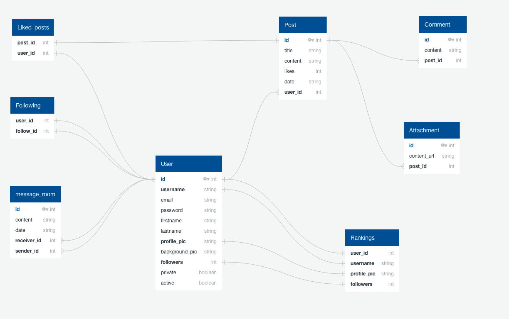

# Postbook

# Summary
# Deployed Project Link

This was a full stack appliction made with a React frontend and with a Django backend. This is a social media application clone, inspiration was taken from Twitter and Facebook. The main goal was to get all the basic functions of a social media app within the timeframe of this project, which was a little over a week. 
- [Postbook](#postbook)
- [Summary](#summary)
- [Deployed Project Link](#deployed-project-link)
- [Brief](#brief)
- [Technologies Used](#technologies-used)
- [Approach Taken](#approach-taken)
- [Visuals](#visuals)
- [Bugs, Blockers & Wins](#bugs-blockers--wins)
- [Future Features](#future-features)
- [Key Learnings](#key-learnings)
# Brief

- **Build a full-stack application** by making your own backend and your own front-end
- **Use a Python Django API** using Django REST Framework to serve your data from a Postgres database
- **Consume your API with a separate front-end** built with React
- **Be a complete product** which most likely means multiple relationships and CRUD functionality for at least a couple of models
- **Implement thoughtful user stories/wireframes** that are significant enough to help you know which features are core MVP and which you can cut
- **Have a visually impressive design** to kick your portfolio up a notch and have something to wow future clients & employers. **ALLOW** time for this.
- **Be deployed online** so it's publicly accessible.

# Technologies Used

- HTML5
- SASS
- JavaScript
- React
- Django
- Python
- PostgreSQL
- Git & Github
- Heroku
- Netlify

# Approach Taken 

I started by making an ERD diagram for my database models. 


Then I wrote the models for the post object. 

```python
class Post(models.Model):
    content = models.TextField(max_length=250)
    created_at = models.DateTimeField(auto_now_add=True)
    updated_at = models.DateTimeField(null=True, auto_now=True)
    user = models.ForeignKey(
        'jwt_auth.User',
        related_name='posts',
        on_delete=models.CASCADE
    )
    liked_by = models.ManyToManyField(
        'jwt_auth.User',
        blank=True
    )

    def __str__(self):
        return f'{self.content}'
```
Also the serializers for the post object.

# Visuals 

# Bugs, Blockers & Wins

# Future Features 

# Key Learnings